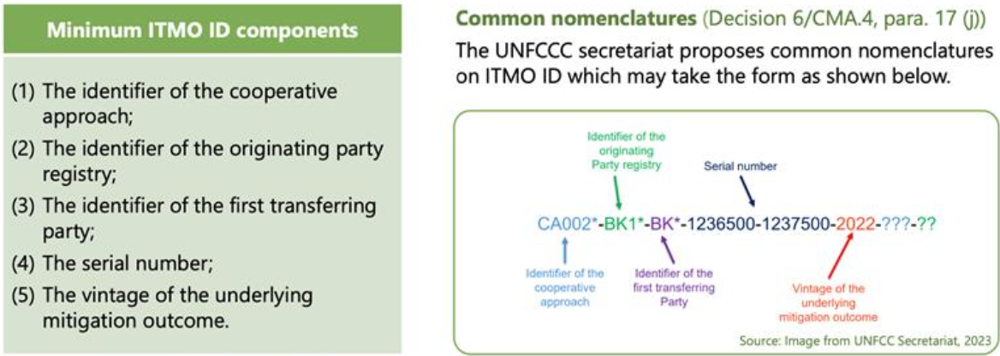
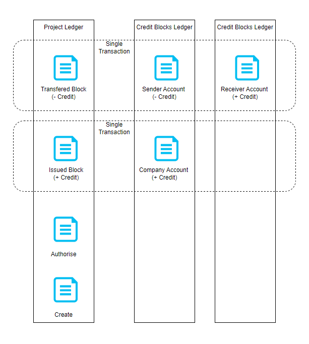
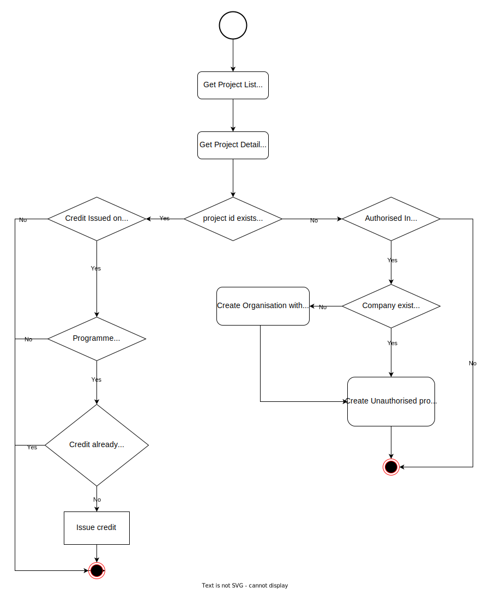

[](https://www.sparkblue.org/group/keeping-track-digital-public-goods-paris-agreement)
[](https://app.digitalpublicgoods.net/a/10403)

<a name="about"></a>

# National Carbon Credit Registry

The National Carbon Registry enables carbon credit trading in order to reduce greenhouse gas emissions.

As an online database, the National Carbon Registry uses national and international standards for quantifying and verifying greenhouse gas emissions reductions by projects, tracking issued carbon credits and enabling credit transfers in an efficient and transparent manner. The Registry functions by receiving, processing, recording and storing data on mitigations projects, the issuance, holding, transfer, acquisition, cancellation, and retirement of emission reduction credits. This information is publicly accessible to increase public confidence in the emissions reduction agenda.

The National Carbon Registry enables carbon credit tracking transactions from mitigation activities, as the digital implementation of the Paris Agreement. Any country can customize and deploy a local version of the registry then connect it to other national & international registries, MRV systems, and more.

The system continues to offer the below key features:

- **User and Organization Management:** The system supports roles like Designated National Authority (DNA), Project Developers (PD), and Independant Certifiers (IC), each with Admin, Manager, or Viewer access. Users can register, log in, and reset passwords. Organizations are created and approved by DNA admins or the root user, with status management.
- **Project Lifecycle:** Projects go through phases: Initial Notification form submission, Project Design Document submission, Validation Report submission, and final Authorization. Each step requires approvals from DNA or IC, with clear statuses and automated notifications. With the Monitoring and Verification reports submissions and approvals, the carbon credits are issued for the project for the amount that was approved when the project was authorized.
- **Credit Transfers and Retirements:** Issued credits can be transferred to other approved organizations or retired voluntarily or through cross-border processes. Transfers and retirements require approval from the DNA. All actions are tracked in detailed tables with status updates.
- **Dashboard and Reporting:**  
  The dashboard displays overall system statistics, including all relevant projects and credit details. Users can also access comprehensive project information on the project detail overview page. This includes an activity timeline, which provides a clear audit trail of all actions performed by stakeholders, ensuring transparency and traceability throughout the project lifecycle.  
  Additionally, the system supports Agreed Electronic Format (AEF) reports, allowing structured reporting of data such as, authorizations, issuances, transfers, and retirements ensuring international compliance and data standardization.

## Index

- [About](#about)
- [Standards](#standards)
- [Changelog](#changelog)
- [Architecture](#architecture)
- [Project Structure](#structure)
- [Run as Containers](#container)
- [Run Services Locally](#local)
- [Run Services on Cloud](#cloud)
- [User Onboarding](#user)
- [Web Frontend](#frontend)
- [Localization](#localization)
- [API](#api)
- [Status Page](#status)
- [Governance & Support](#support)

<a name="standards"></a>

## Standards

This codebase aims to fullfill the digital public goods standard:
https://digitalpublicgoods.net/standard/
It is built according to the Principles for Digital Development:
https://digitalprinciples.org/

<a name="changelog"></a>

## Changelog

[Learn about the latest improvements.](./CHANGES.md)

<a name="architecture"></a>

## System Architecture

UNDP Carbon Registry is based on service oriented architecture (SOA). Following diagram visualize the basic components in the system.


<a name="services"></a>

### **System Services**

#### _National Service_

Authenticate, Validate and Accept user (DNA, Project Developer/Certifier) API requests related to the following functionalities,

- User and company CRUD operations.
- User authentication.
- Project life cycle management.
- Credit life cycle management.

Service is horizontally scalable and state maintained in the following locations,

- File storage.
- Operational Database.
- Ledger Database.

Uses the Serial Number Generator service to issue a serial number and track credits through any transaction.
Uses Ledger interface to persist project and credit life cycles.

#### _Analytics Service_

Serve all the system analytics. Generate all the statistics using the operational database.
Horizontally scalable.

#### _Replicator Service_

Asynchronously replicate ledger database events in to the operational database. During the replication process it injects additional information to the data for query purposes (Eg: Location information).
Currently implemented for QLDB and PostgresSQL ledgers. By implementing [replicator interface](./backend/services/src/ledger-replicator/replicator-interface.service.ts) can support more ledger replicators.
Replicator select based on the `LEDGER_TYPE` environment variable. Support types `QLDB`, `PGSQL(Default)`.

### **Serial Number Generation And Tracking**

The UNDP demo registry will generate and record a unique Project ID for each project for credit issuance, where each credit will receive a distinct Credit ID (serial number). The Credit ID (serial number) format aligns with UNFCCC guidance on ITMO ID formatting, as outlined in Decision 6/CMA.4, paragraph 17. This ensures that the system is designed to generate ITMO IDs by default in accordance with UNFCCC standards.



#### _Project Authorization_

A unique project identifier is created for the project. It consists upto the project ID section of the serial number format.<br>
Example: CA0004-VU-CH-356

#### _Credit Issuance_

A batch of credits is issued each time a project undergoes monitoring and verification. Issuance may include multiple vintages.<br>
Example:

- In January 2024, Batch 1 with 3,000 total credits is issued, vintage of 2023.The start and end block number: 1-3000. Serial number for credits: CA0004-VU-CH-356-1-3000-2023
- In January 2025, Batch 2 with 2,000 credits is issued, vintage 2024. The start and end block number: 3001-5000. Serial number for credits: CA0004-VU-CH-356-3001-5000-2024

#### _Credit Transfer or Retire_

When credits are Tranferred or Retired, it can be a transaction of a full block or a partial amount of a block.<br>

- When a full block transfer happens, the ownership of the credit block change accordingly. Credit balances of both companies should be updated to reflect the ownership change.<br>
  Example: Transfer of 3000 credits from CA0004-VU-CH-356-1-3000-2023 block.<br>
  Before transaction: CA0004-VU-CH-356-1-3000-2023 : Owner 1<br>
  After transaction: CA0004-VU-CH-356-1-3000-2023 : Owner 2
- When partial block transfer happens, the current owner always retains the first serial number block and gives away the last serial number block.<br>
  Example: Transfer of 1000 credits from CA0004-VU-CH-356-1-3000-2023 block.<br>
  Before transaction: CA0004-VU-CH-356-1-3000-2023 : Owner 1<br>
  After transaction: CA0004-VU-CH-356-1-2000-2023 : Owner 1 and CA0004-VU-CH-356-2001-3000-2023 : Owner 2

When transferring credit amount from multiple blocks, the current owner retains the first serial number blocks and gives away the last serial number blocks.

### **Deployment**

System services can deploy in 2 ways.

- **As a Container** - Each service boundary containerized in to a docker container and can deploy on any container orchestration service. [Please refer Docker Compose file](./docker-compose.yml)
- **As a Function** - Each service boundary packaged as a function (Serverless) and host on any Function As A Service (FaaS) stack. [Please refer Serverless configuration file](./backend/services/serverless.yml)

### **External Service Providers**

All the external services access through a generic interface. It will decouple the system implementation from the external services and enable extendability to multiple services.

**Geo Location Service**

Currently implemented for 2 options.

1. File based approach. User has to manually add the regions with the geo coordinates. [Sample File](./backend/services/regions.csv). To apply new file changes, replicator service needs to restart.
2. [Mapbox](https://mapbox.com). Dynamically query geo coordinates from the Mapbox API.

Can add more options by implementing [location interface](./backend/services/src/shared/location/location.interface.ts)

Change by environment variable `LOCATION_SERVICE`. Supported types `MAPBOX`, `FILE(Default)`

**File Service**

Implemented 2 options for static file hosting.

1. NestJS static file hosting using the local storage and container volumes.
2. AWS S3 file storage.

Can add more options by implementing [file handler interface](./backend/services/src/shared/file-handler/filehandler.interface.ts)

Change by environment variable `FILE_SERVICE`. Supported types `S3`, `LOCAL(Default)`

### **Database Architecture**

Primary/secondary database architecture used to store carbon project and account balances.
Ledger database is the primary database. Add/update projects and update account balances in a single transaction. Currently implemented only for AWS QLDB

Operational Database is the secondary database. Eventually replicated to this from primary database via data stream. Implemented based on PostgresSQL

**Why Two Database Approach?**

1. Cost and Query capabilities - Ledger database (blockchain) read capabilities can be limited and costly. To support rich statistics and minimize the cost, data is replicated in to a cheap query database.
2. Disaster recovery
3. Scalability - Primary/secondary database architecture is scalable since additional secondary databases can be added as needed to handle more read operations.

**Why Ledger Database?**

1. Immutable and Transparent - Track and maintain a sequenced history of every carbon project and credit change.
2. Data Integrity (Cryptographic verification by third party).
3. Reconcile carbon credits and company account balance.

**Ledger Database Interface**

This enables the capability to add any blockchain or ledger database support to the carbon registry without functionality module changes. Currently implemented for PostgresSQL and AWS QLDB.

**PostgresSQL Ledger Implementation** storage all the carbon project and credit events in a separate event database with the sequence number. Support all the ledger functionalities except immutability.

Single database approach used for user and company management.

### **Ledger Layout**

Carbon Registry contains 2 ledger tables.

1. Project ledger - Contains all the project and credit transactions.
2. Credit Blocks Ledger (Credit) - Contains credit blocks, transactions and ownership.

The below diagram demonstrates the ledger behavior of project create, authorise, issue and transfer processes. Blue color document icon denotes a single data block in a ledger.



### **Authentication**

- JWT Authentication - All endpoints based on role permissions.
- API Key Authentication - MRV System connectivity.

<a name="structure"></a>

## Project Structure

    .
    ├── .github                         # CI/CD [Github Actions files]
    ├── deployment                      # Declarative configuration files for initial resource creation and setup [AWS Cloudformation]
    ├── backend                         # System service implementation
        ├── services                    # Services implementation [NestJS application]
            ├── src
                ├── national-api        # National API [NestJS module]
                ├── stats-api           # Statistics API [NestJS module]
                ├── ledger-replicator   # Blockchain Database data replicator [QLDB to Postgres]
            ├── libs
                ├── core                # System and database configurations
                ├── shared              # Shared resources [NestJS module]
            ├── serverless.yml          # Service deployment scripts [Serverless + AWS Lambda]
    ├── web                             # System web frontend implementation [ReactJS]
    ├── .gitignore
    ├── docker-compose.yml              # Docker container definitions
    └── README.md

<a name="container"></a>

## Run Services As Containers

- Update [docker compose file](./docker-compose.yml) env variables as required.
  - Currently all the emails are disabled using env variable `IS_EMAIL_DISABLED`. When the emails are disabled email payload will be printed on the console. User account passwords needs to extract from this console log. Including root user account, search for a log line starting with `Password (temporary)` on national container (`docker logs -f undp-carbon-registry-national-1`).
  - Add / update following environment variables to enable email functionality.
    - `IS_EMAIL_DISABLED`=false
    - `SOURCE_EMAIL` (Sender email address)
    - `SMTP_ENDPOINT`
    - `SMTP_USERNAME`
    - `SMTP_PASSWORD`
  - Use `DB_PASSWORD` env variable to change PostgresSQL database password
  - Configure system root account email by updating environment variable `ROOT EMAIL`. If the email service is enabled, on the first docker start, this email address will receive a new email with the root user password.
  - By default frontend does not show map images on dashboard and project view. To enable them please update `REACT_APP_MAP_TYPE` env variable to `Mapbox` and add new env variable `REACT_APP_MAPBOXGL_ACCESS_TOKEN` with [MapBox public access token](https://docs.mapbox.com/help/tutorials/get-started-tokens-api/) in web container.
- Add user data
  - Update [organisations.csv](./organisations.csv) file to add organisations.
  - Update [users.csv](./users.csv) file to add users.
  - When updating files keep the header and replace existing dummy data with your data.
  - These users and companys add to the system each docker restart.
- Run `docker-compose up -d --build`. This will build and start containers for following services,
  - PostgresDB container
  - National service
  - Analytics service
  - Replicator service
  - React web server with Nginx.
- Web frontend on http://localhost:3030/
- API Endpoints,
  - http://localhost:3000/national#/
  - http://localhost:3100/stats#/

<a name="local"></a>

## Run Services Locally

- Setup postgreSQL locally and create a new database.
- Update following DB configurations in the .env.local file (If the file does not exist please create a new .env.local)
  - DB_HOST (Default localhost)
  - DB_PORT (Default 5432)
  - DB_USER (Default root)
  - DB_PASSWORD
  - DB_NAME (Default carbondbdev)
- Move to folder `cd backend/service`
- Run `yarn run sls:install `
- Initial user data setup `serverless invoke local --stage=local --function setup --data '{"rootEmail": "<Root user email>","systemCountryCode": "<System country Alpha 2 code>", "name": "<System country name>", "logoBase64": "<System country logo base64>"}'`
- Start all the services by executing `sls offline --stage=local`
- Now all the system services are up and running. Swagger documentation will be available on `http://localhost:3000/local/national`

<a name="cloud"></a>

## Deploy System on the AWS Cloud

- Execute to create all the required resources on the AWS.
  ```
  aws cloudformation deploy --template-file ./deployment/aws-formation.yml --stack-name carbon-registry-basic --parameter-overrides EnvironmentName=<stage> DBPassword=<password> --capabilities CAPABILITY_NAMED_IAM
  ```
- Setup following Github Secrets to enable CI/CD
  - AWS_ACCESS_KEY_ID
  - AWS_SECRET_ACCESS_KEY
- Run it manually to deploy all the lambda services immediately. It will create 2 lambda layers and following lambda functions,
  - national-api: Handle all carbon registry user and program creation. Trigger by external http request.
  - replicator: Replicate Ledger database entries in to Postgres database for analytics. Trigger by new record on the Kinesis stream.
  - setup: Function to add initial system user data.
- Create initial user data in the system by invoking setup lambda function by executing
  ```
  aws lambda invoke \
      --function-name carbon-registry-services-dev-setup --cli-binary-format raw-in-base64-out\
      --payload '{"rootEmail": "<Root user email>","systemCountryCode": "<System country Alpha 2 code>", "name": "<System country name>", "logoBase64": "<System country logo base64>"}' \
      response.json
  ```

<a name="external"></a>

## External Connectivity

### ITMO Platform

1. Carbon Registry make a daily to the retrieve ITMO platform projects.
2. Projects create in the Carbon Registry when projects are authorized in the ITMO Platform
3. The Carbon Registry update when the projects are Issued with credits in the ITMO Platform

#### <b>Lifecycle</b>



#### <b>Project Creation and Authorisation</b>

- Authorisation of projects in the ITMO Platform identified by the event name: "ITMO-Design Document (DD) & Validation Report / Upload on National Public Registry".
- If the Company Tax Id doesn’t exist in the Carbon Registry, that company created in the Carbon Registry.
- When creating the project:
  - The project created with the state “Pending”
  - The credit estimate set to 100 by default
  - The company percentage set to 100%
  - The serial number for the project generated the same as any other project in the Carbon Registry.
- Projects retrieved from the ITMO Platform and created in the Carbon Registry can Authorised/Rejected by a DNA user the same as any other project in the Carbon Registry
- When a project is authorised, the authorised credits will be the default credit estimate mentioned above. The project can be issued with credits by a DNA user the same as any other project in the Carbon Registry.

#### <b>Credit Issuance</b>

- Credits can be issued for projects retrieved from the ITMO Platform and created in the Carbon Registry in two ways;
  - By a DNA user the same as any other project.
  - Credit issuance in the ITMO Platform which should be reflected in the Carbon Registry.
- In the case of 2 above,
  - Credit issuance identified by the event name: "Upload Final Monitoring Report" in the ITMO Platform.

#### <b>Field Mapping</b>

<b>Company</b>
| **Name in the Carbon Registry** | **Mandatory in the Carbon Registry** | **Name in the ITMO Platform** |
| --- | --- | --- |
| Tax ID (_taxId_) | Yes | company |
| Name (_name_) | Yes | company |
| Email (_email_) | Yes | Set default : nce.digital+[_organisation_]@undp.org |
| Phone Number (_phoneNo_) | Yes | Set default : 00 |
| Website | | |
| Address | | Set default : Country if the Registry |
| Logo | | |
| Country (_country_) | | Set default : Country of the Registry |
| Role (_companyRole_) | Yes | Set default : ProgrammeDeveloper |

<br><b>User</b>
| Name in the Carbon Registry | Mandatory in the Carbon Registry | Name in the ITMO Platform |
| --- | --- | --- |
| Email (_email_) | Yes | Set default : nce.digital+[_organisation_]@undp.org |
| Role (_role_) | Yes | Set default : Admin |
| Phone Number (_phoneNo_) | | Set default : 00 |

<br><b>Project</b>
| **Name in the Carbon Registry** | **Mandatory in the Carbon Registry** | **Name in the ITMO Platform** |
| --- | --- | --- |
| Project Name (title) | Yes | Name |
| External ID (externalId) | Yes | id |
| Credit Issuance Serial Number | | |
| Current Status | | Set default : Pending |
| Applicant Type | | Set default : Project Developer |
| Sector (_sector_) | Yes | [Sector](#itmo-sector-mapping) |
| Sectoral Scope (_sectoralScope_) | Yes | [Sector](#itmo-sector-mapping)|
| Project Start Date (_startTime_) | Yes | createdAt |
| Project End Date (_endTime_) | Yes | createdAt + 10 years |
| Geographical Location (Regional) (_geographicalLocation_) | Yes | country _(Name not mentioned as ISO3 or actual name)_ |
| Buyer Country Eligibility | | |
| Project Cost (USD) (_programmeCostUSD_) | Yes | Set default : Null |
| Financing Type | | |
| Grant Equivalent Amount | | |
| Carbon Price (Dollars per ton) | | |
| Company | | company |
| Company Tax ID (_proponentTaxVatId_) | Yes | company |
| Company Percentage (_proponentPercentage_) | Yes | Set default : 100% |
| Type of Mitigation Action/Activity (_typeOfMitigation_) | Yes | [Sector](#itmo-sector-mapping) |
| GHGs Covered (_greenHouseGasses_) | Yes | Set default : CO2 |
| Credits Authorised | | Set default : 100 |
| Credits Issued | | Set default : 10 |
| Credits Transferred | | |
| Credits Frozen | | |
| Credits Retired | | |
| Credits authorised for international transfer and use (Total cumulative maximum amount of Mitigation Outcomes for which international transfer and use is authorized) | | |
| Crediting Period (years) | | |
| Project Materials | | Files \* |
| Project Materials | | Files \* |
| **Credit Calculation Fields / Mitigation Type Calculation** | | |
| **Agriculture** | | |
| Land Area | | |
| Land Area Unit | | |
| **Solar** | | |
| energy generation | | |
| energy generation unit | | |
| consumer group | | |

#### <b>ITMO Sector Mapping</b>

| ITMO Sector Field Value | Sector      | Sectoral Scope      | Type Of Mitigation  |
| ----------------------- | ----------- | ------------------- | ------------------- |
| energy-distribution     | Energy      | Energy Distribution | Energy Distribution |
| agriculture             | Agriculture | Agriculture         | Agriculture         |
| energy-industries       | Energy      | Energy Industry     | EE Industry         |
| Default                 | Other       | Energy Industry     | EE Industry         |

#### <b>Assumptions</b>

- Project estimated credit amount is 100.
- Project issued credit amount is always 10.

#### <b>Docker Integration Setup</b>

1. Append `data-importer` to `docker-compose` file `replicator` service `RUN_MODULE` env variable with comma separated.
2. Update following env variables in the `docker-compose` file `replicator` service.
   - ITMO_API_KEY
   - ITMO_EMAIL
   - ITMO_PASSWORD
   - ITMO_ENDPOINT
3. Projects will import on each docker restart.

<a name="user"></a>

## User Onboarding and Permissions Model

### User Roles

System pre-defined user roles are as follows,

- Root
- Company Level (DNA, Project and Certification Company come under this level)
  - Admin
  - Manager
  - View Only

### User Onboarding Process

1. After the system setup, the system have a Root User for the setup email (one Root User for the system)
2. Root User is responsible for creating the DNA entity and the Admin of the DNA
3. The DNA Admin is responsible for creating the other companies and Admins of each company.
4. Admin of the company has the authority to add the remaining users (Admin, Managers, View Only Users) to the company.
5. When a user is added to the system, a confirmation email should be sent to users including the login password.

### User Management

All the CRUD operations can be performed as per the following table,

| Company Role            | New User Role                 | Authorized User Roles (Company)                                                                     |
| ----------------------- | ----------------------------- | --------------------------------------------------------------------------------------------------- |
| DNA                     | Root                          | Cannot create new one other than the default system user and Can manage all the users in the system |
| DNA                     | Admin<br>Manager<br>View Only | Root<br>Admin(DNA)                                                                                  |
| All other Company Roles | Admin<br>Manager<br>View Only | Root<br>Admin(DNA)<br>Admin(Company)                                                                |

- All users can edit own user account except Role and Email.
- Users are not allowed to delete the own account from the system.

<a name="frontend"></a>

### Web Frontend

Web frontend implemented using ReactJS framework. Please refer [getting started with react app](./web/README.md) for more information.

<a name="localization"></a>

### Localization

- Languages (Current): English
- Languages (In Progress): French. Spanish
  Please refer [here](./web/public/locales/i18n/README.md) for adding a new language translation file.

<a name="api"></a>

### Application Programming Interface (API)

For integration, reference RESTful Web API Documentation documentation via Swagger. To access

- National API: api.APP_URL/national
- Status API: api.APP_URL/stats

<a name="resource"></a>

### Resource Requirements

| Resource |                                            Minimum | Recommended |
| :------- | -------------------------------------------------: | ----------: |
| Memory   |                                               4 GB |        8 GB |
| CPU      |                                            4 Cores |     4 Cores |
| Storage  |                                              20 GB |       50 GB |
| OS       | Linux <br> Windows Server 2016 and later versions. |             |

Note: Above resource requirement mentioned for a single instance from each microservice.

<a name="status"></a>

### Status Page

For transparent uptime monitoring go to status.APP_URL
Open source code available at https://github.com/undp/carbon-registry-status

<a name="support"></a>

### Governance and Support

The United Nations Development Program (UNDP) is responsible for managing the application. To ensure alignment with international demand, Digital For Climate (D4C) will act as an advisory body to the Digital Public Good Carbon Registry codebase. D4C is a collaboration between [European Bank for Reconstruction and Development (EBRD)](https://www.ebrd.com), [United Nations Development Program (UNDP)](https://www.undp.org), [United Nations Framework Convention on Climate Change (UNFCCC)](https://www.unfccc.int), [International Emissions Trading Association (IETA)](https://www.ieta.org), [European Space Agency (ESA)](https://www.esa.int), and [World Bank Group](https://www.worldbank.org)  that aims to coordinate respective workflows and create a modular and interoperable end-to-end digital ecosystem for the carbon market. The overarching goal is to support a transparent, high integrity global carbon market that can channel capital for impactful climate action and low-carbon development.

This code is managed by [United Nations Development Programme](https://www.undp.org) as custodian, detailed in the press release. For technical questions, please visit the community of practice [‘Keeping Track of the Paris Agreement’](<https://unfccc.int/news/paris-agreement-progress-tracker](https://www.sparkblue.org/group/keeping-track-digital-public-goods-paris-agreement/content/fourth-community-practice-meeting)>) or submit through the [open forum](https://github.com/undp/carbon-registry/discussions). For any other questions, contact us at digital4planet@undp.org.
